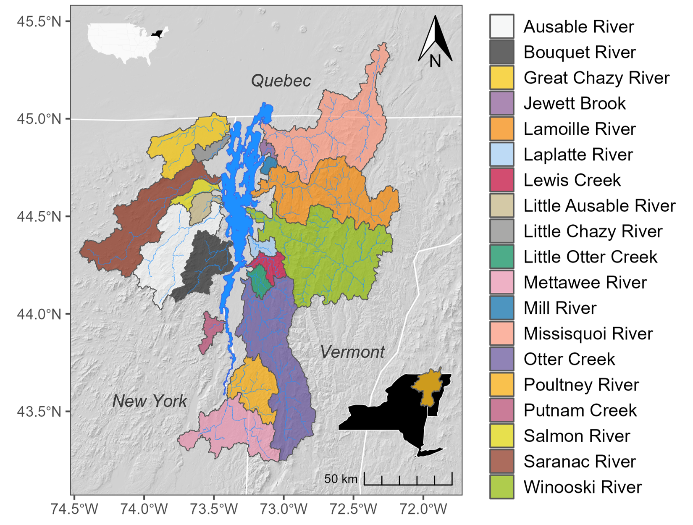

# wqforecast-tutorial
Repo for DevCon2025 Water Quality Forecasting Workshop

## Overview

This repo contains the materials necessary to complete the various activities within the Post-Processing Operational Flow Forecasts to Forecast Water Quality workshopat CIROH DevCon 2025. This workshop in general serves to demonstrate the workflow necessary for taking operational NWM flow forecasts and transforming them into water quality forecasts for any constituent of interest (e.g., phosphorus) at any location of interest (e.g., the Winooski River in Vermont). By completing this workshop, attendees will have the tools at hand to adopt and adapt our outlined approach to meet their interests and needs. 

The testbed for this workshop is the Lake Champlain Basin of Vermont and New York, USA, and Quebec, Canada. 

<figcaption> <b>Figure 1.</b> The Lake Champlain Basin and major tributaries. </figcaption>

## Contents

* [**00_functions**](https://github.com/jtkemper/wqforecast-tutorial/blob/main/notebooks/00_functions.ipynb): this is where all the functions (for feature selection and model testing) live

* [**01_model_development**](https://github.com/jtkemper/wqforecast-tutorial/blob/main/notebooks/01_model_development.ipynb): perform feature selection and model development w/ LightGBM

* [**02_toy_forecasting_example**](https://github.com/jtkemper/wqforecast-tutorial/blob/main/notebooks/02_toy_forecasting_example.ipynb): use trained LightGBM models to forecast phosphorus concentration for two June & July 2024 in the Lake Champlain Basin

